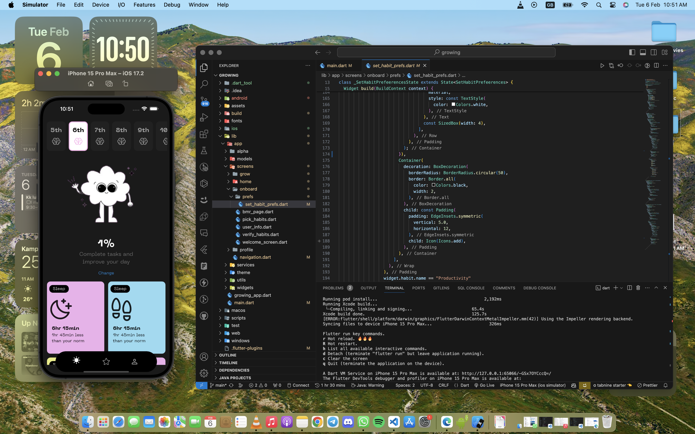
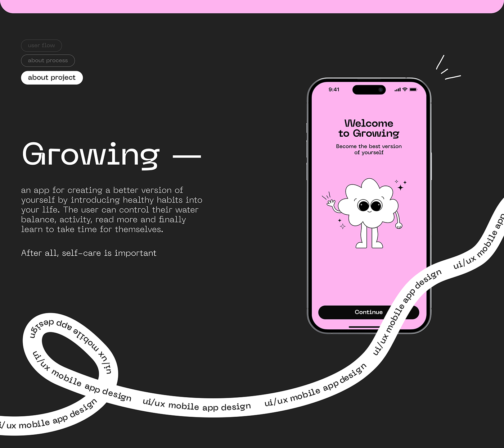
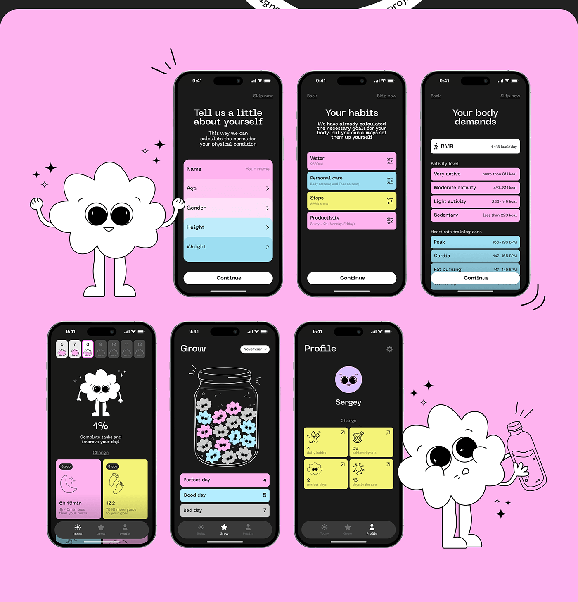
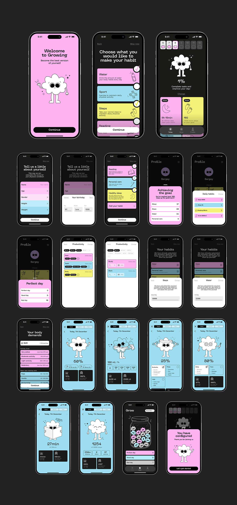

# growing

_Become the best version of yourself._

<h1 align="center" >

    
     
      
      <br/>
    
  </h1>

## Getting Started

Running on

```
3.16.0 Flutter SDK
3.2.0 Dart SDK
```

Designed by

```
telegram:
    @anastasia_mozuleva
    @sergey_limonov
```
